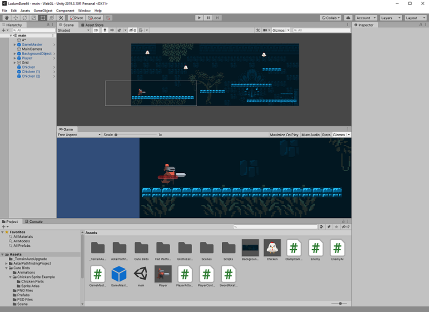
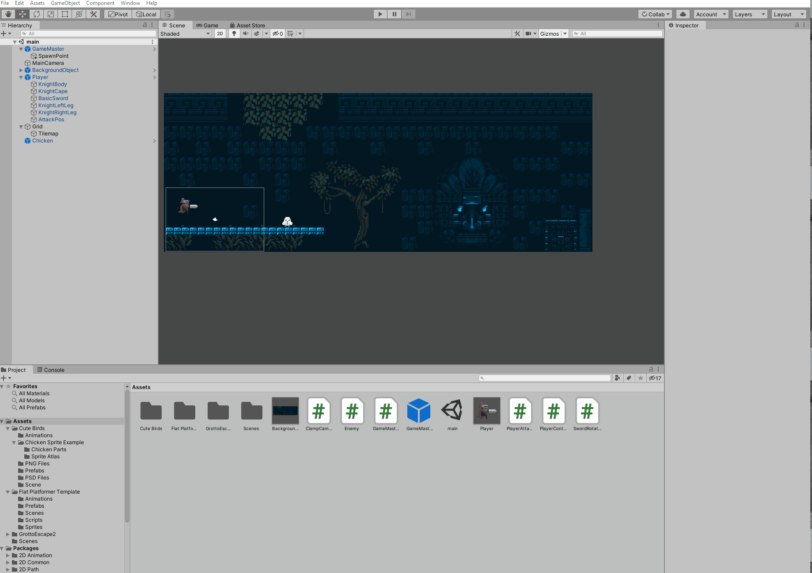
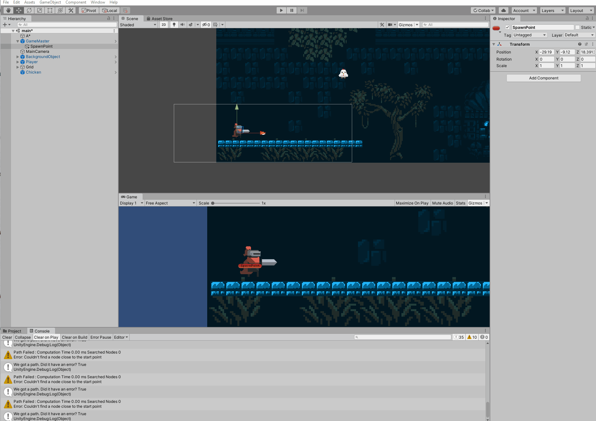

# LudumDare46
Create a game using Unity and C# in 48 hours for LudumDare 46 (April 17-20, 2020).

## Where's the entire source code?

I only uploaded the scripts I wrote because the artwork I used is not my own. From my understanding, their licenses prohibit me from uploading them to a public repo. But if you'd like to check out the project in more detail and load it in Unity yourself, let me know and I'll share a zip folder privately.

## WebGL Build

Download the WebGL build from this zip: https://drive.google.com/open?id=1rX73OPSRdNbdfdIJ7ImmS9maI147hi4t

I had a much more fitting game idea that would better match the theme "Keep it Alive", but that idea turned out to be too large, so I just focused on the basics of a platformer game. The object of the game is to hit the chickens before they hit you. To hit them, aim the sword, and when they come into contact with the sword, left click. If the chickens hit the body of the player sprite, player dies and immediately respawns.

## Artwork

Artwork is not my own! Thank you to the talented people who made the sprites and shared them on the Unity Asset Store:
* Chicken: Cute Birds by Minotaur
* Red Knight: Flat Platformer Template by Bulat
* Environment: Grotto Escape II by Ansimuz

## Blooper Reel

Developing a game for the first time, I didn't know there could be such spectacular bugs. Here's the best:

**Knocked over player still operational**

**Respawn logic fail**

**Enemy AI pathfinding fail**

Where are you going, Chicken???

